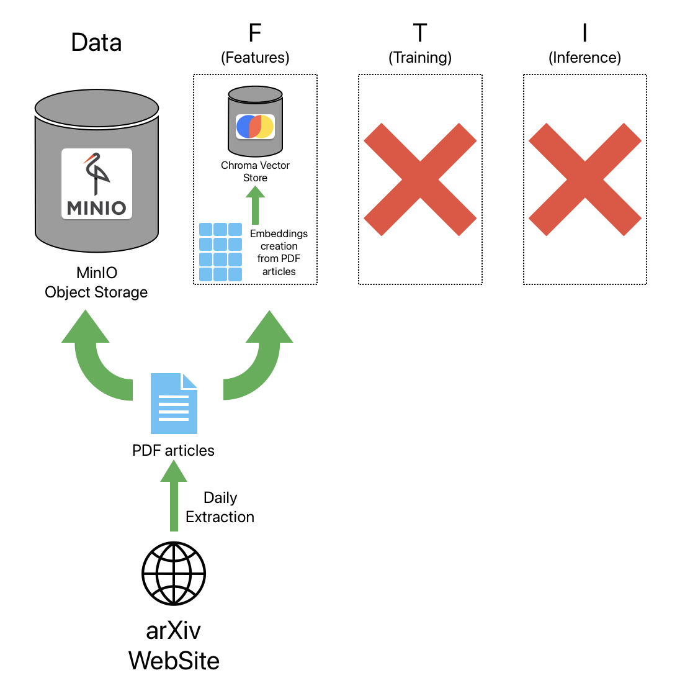

# arXivFlow

arXivFlow is a project that enables you to automatically fetch, process, and ingest the latest ArXiv research papers on any given topic on a daily basis. This daily retrieval supports continuous technological monitoring, ensuring that you stay up-to-date with emerging research and trends. The pipeline is orchestrated using [Prefect](https://www.prefect.io/) for scheduling and seamless automation, and it stores the retrieved PDFs in a [MinIO](https://min.io/) object storage system for efficient management and retrieval.

<div align="center">
    
</div>

## Features

- Fetch ArXiv Papers: Automatically query the ArXiv API for research papers based on a topic and publication date.
- PDF Ingestion: Download the PDF files and store them in a MinIO bucket.
- Pipeline Orchestration: Use Prefect flows and tasks to schedule and manage the pipeline.

## Installation

1. Clone the repository

```bash
git clone https://github.com/Bessouat40/arXivFlow.git
cd arXivFlow
```

2. Configure .env File

You'll need to rename **.env.example** file and fill it with your own values :

```bash
mv .env.example .env
```

3. Install the required packages

```bash
python -m pip install -r backend/requirements.txt
cd frontend
npm i
```

## Usage

### Start the Pipeline with Prefect locally

You can run the pipeline as a scheduled flow using Prefect. For example, to run the pipeline daily at midnight, use the Prefect deployment approach or serve the flow directly (for testing purposes).

```bash
python -m backend.main
```

### Running the UI

You can run the pipeline as a scheduled flow using Prefect. For example, to run the pipeline daily at midnight, use the Prefect deployment approach or serve the flow directly (for testing purposes).

```bash
python -m main
```

### Running Pipelines and UI with Docker

You can now run Prefect flow inside a Docker container :

```bash
docker-compose up -d --build
```

Now you can access Prefect UI at [localhost:4200](http://localhost:4200/dashboard).

Your flow will run every day at midnight.

## Configuration

### Topic

The pipeline fetches articles based on a given topic.

You can modify this parameter in the **.env** file.

## Prerequisites

- MinIO: Make sure you have a running MinIO server. You can start one using Docker:

```bash
docker run -d --name minio_server \
  -p 9000:9000 \
  -p 9001:9001 \
  -e MINIO_ROOT_USER=minioadmin \
  -e MINIO_ROOT_PASSWORD=minioadmin \
  minio/minio server /data --console-address ":9001"
```

## TODO

- [x] **Containerization with Docker:** Create a Dockerfile to containerize the application and manage its dependencies.

- [x] **Embedding Extraction:** Use a model to extract and store embeddings from the PDFs for later semantic search.

- [x] **Semantic Search:** Implement a semantic search feature that leverages the stored embeddings to enable more accurate article search.

- [x] **Add UI**
